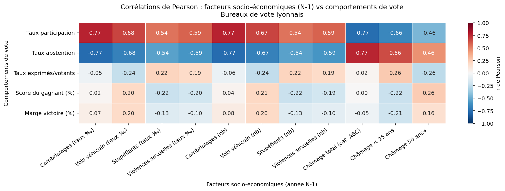
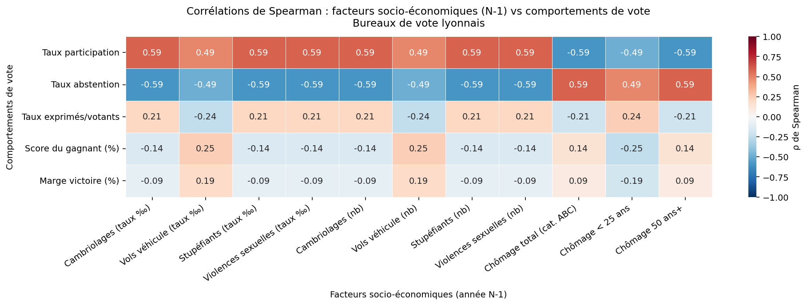
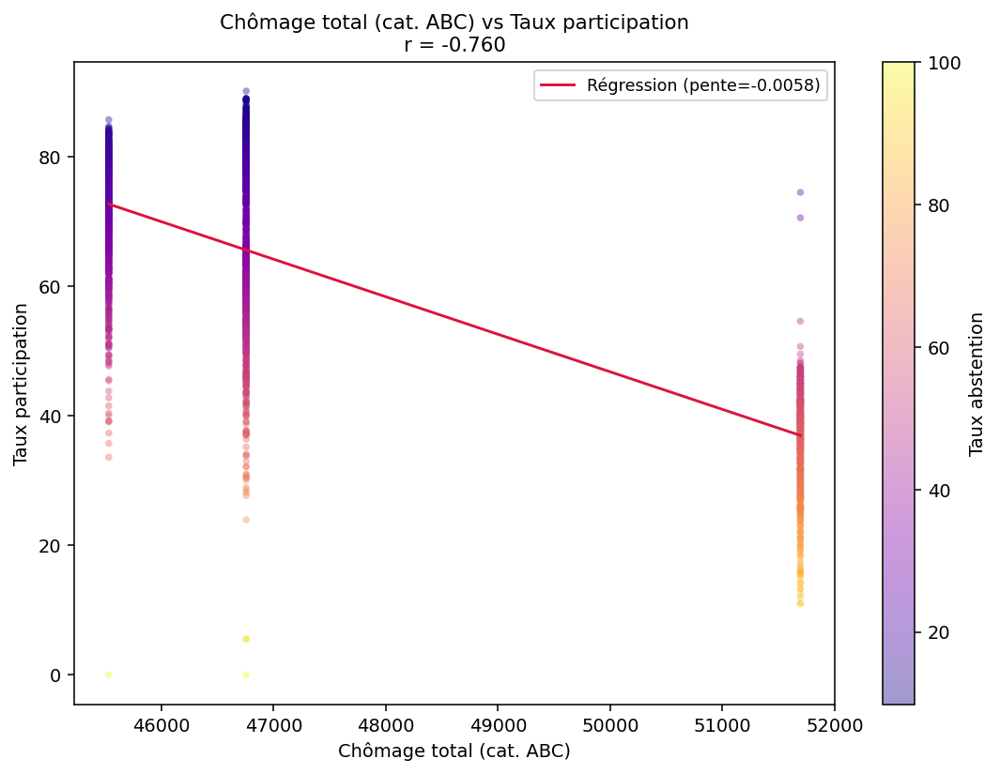
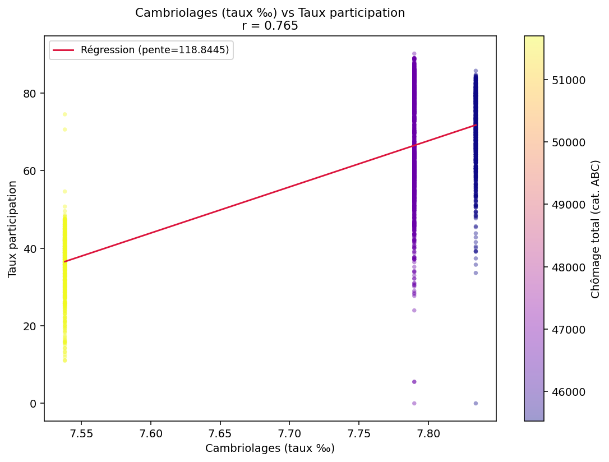
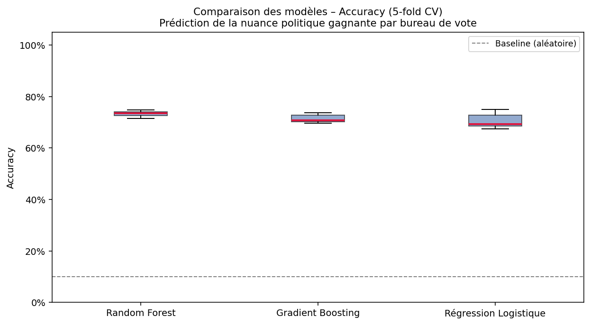
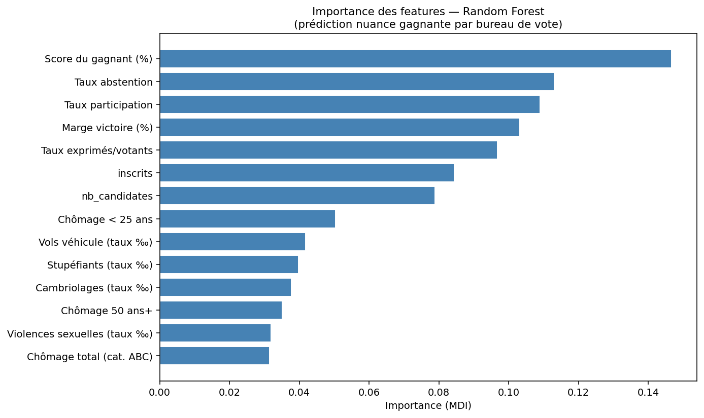
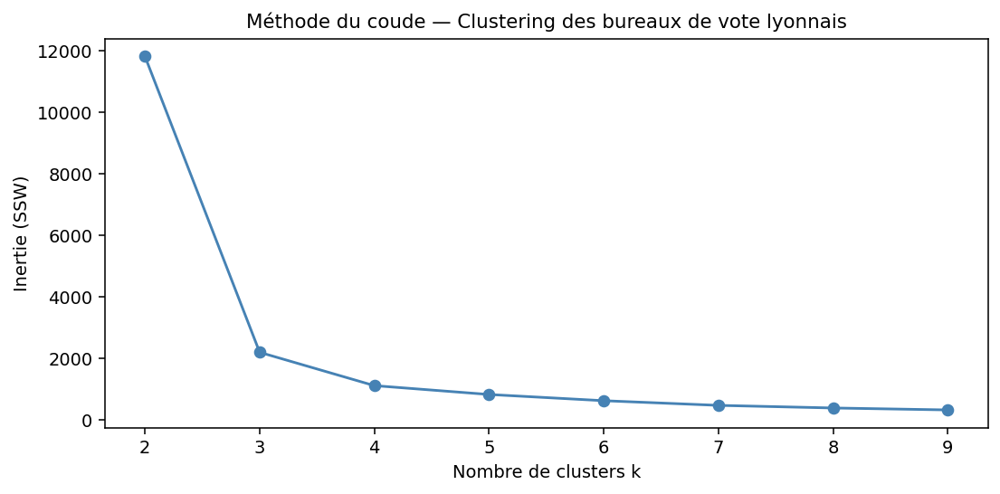
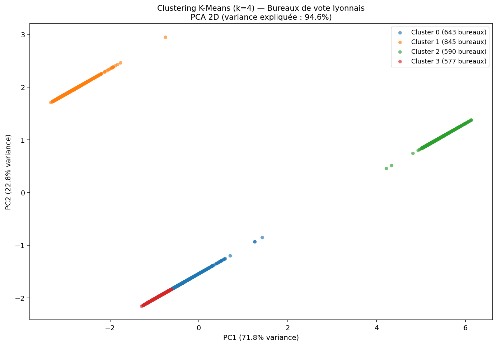
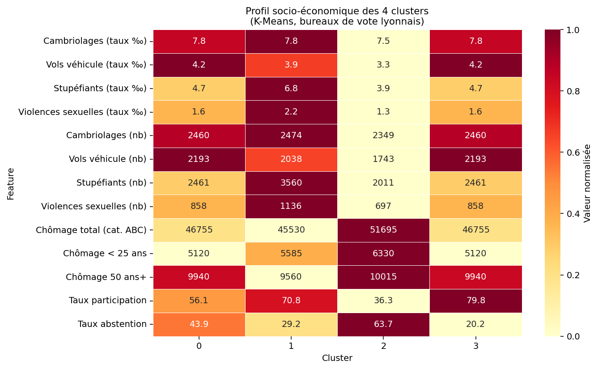
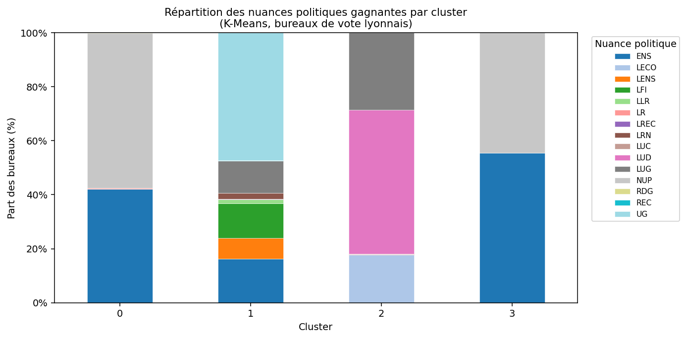

# Module ML — Corrélations socio-économiques / comportements de vote

> **Objectif** : étudier les corrélations entre facteurs socio-économiques (délinquance, chômage) et comportements de vote à l'échelle des bureaux de vote lyonnais, puis construire un modèle prédictif de la nuance politique gagnante.

---

## Lancement

```bash
# Depuis la racine du projet
pip install -r requirements.txt

PYTHONPATH=src python src/ml/predict.py
```

Les visualisations sont sauvegardées automatiquement dans `src/ml/outputs/`.

---

## Source de données

Le pipeline charge la vue matérialisée **`mart.ml_features_bureau_final`** (couche Gold du Data Warehouse), **filtrée sur les 3 dernières années disponibles : 2021, 2022, 2024** (soit 2 655 lignes).

| Groupe | Variables |
|---|---|
| Participation | `inscrits`, `votants`, `abstentions`, `taux_participation`, `taux_abstention` |
| Résultat électoral | `winner_nuance`, `winner_ratio_exprimes`, `margin_ratio_exprimes`, `nb_candidates` |
| Délinquance *(année N-1)* | cambriolages, vols de véhicule, stupéfiants, violences sexuelles — taux ‰ et nombre brut |
| Chômage *(année N-1)* | `chomage_abc_total`, `chomage_abc_moins25`, `chomage_abc_50plus` |

> **Lag temporel N-1** : les données socio-économiques sont jointes avec un décalage d'un an pour éviter toute fuite de données (*data leakage*) et modéliser l'influence des conditions antérieures sur le vote. Par exemple, les données de délinquance 2020 sont associées aux élections 2021.

---

## Questions de fond

### Quelle donnée est la plus corrélée aux résultats des élections ?

#### Résultats mesurés (r de Pearson, données 2021–2024)

| Rang | Variable socio-économique (N-1) | Comportement de vote | r de Pearson |
|:---:|---|---|:---:|
| 1 | **Cambriolages (taux ‰)** | Taux de participation | **+0.771** |
| 2 | **Cambriolages (nombre)** | Taux de participation | **+0.771** |
| 3 | **Cambriolages (taux ‰)** | Taux d'abstention | **-0.770** |
| 4 | **Chômage total (cat. ABC)** | Taux d'abstention | **+0.766** |
| 5 | **Vols de véhicule (taux ‰)** | Taux de participation | **+0.680** |

**La donnée la plus corrélée aux résultats électoraux est le taux de cambriolages de l'année précédente (r = ±0.771).**

Ce résultat contre-intuitif s'explique par la géographie lyonnaise : les arrondissements avec un fort taux de cambriolages sont aussi les arrondissements les plus centraux et les plus denses (1er, 2e, 6e), où la participation est historiquement plus élevée. Il ne s'agit donc pas d'un lien direct "cambriolages → vote", mais d'une **corrélation territoriale** : ces zones partagent un profil socio-démographique (revenus élevés, forte mobilisation civique) qui explique à la fois les deux variables.

Le chômage total (r = +0.766 avec l'abstention) traduit un lien plus attendu : **plus le chômage est élevé dans une commune, plus l'abstention est forte**. Ce phénomène de désaffection électorale dans les zones de précarité est documenté dans la littérature en science politique.

> **Rappel** : la corrélation n'est pas une causalité — ces chiffres mesurent une association statistique, pas un lien de cause à effet.

---

### Principe de l'apprentissage supervisé

L'**apprentissage supervisé** (*supervised learning*) est une branche du machine learning dans laquelle le modèle apprend à partir d'un **jeu de données étiqueté** : chaque observation d'entrée `X` est associée à une sortie connue `y` (l'étiquette).

```
1. DONNÉES LABELLISÉES
   X = features socio-économiques + électoraux d'un bureau de vote
   y = nuance politique gagnante (étiquette connue)
          │
          ▼
2. ENTRAÎNEMENT (80 % des données)
   Le modèle ajuste ses paramètres internes pour apprendre
   la fonction f : X → y. Il ne voit jamais le jeu de test.
          │
          ▼
3. PRÉDICTION (20 % jamais vus)
   Le modèle applique f à de nouvelles observations
   et produit une prédiction ŷ pour chaque bureau.
          │
          ▼
4. ÉVALUATION
   On compare ŷ aux vraies étiquettes y :
   → accuracy, precision, recall, F1-score
```

**Dans ce projet :**

| Élément | Valeur |
|---|---|
| Entrées `X` | 14 features (participation, délinquance N-1, chômage N-1…) |
| Cible `y` | `winner_nuance` — nuance politique gagnante par bureau |
| Algorithme retenu | Random Forest (200 arbres de décision) |
| Séparation | 80 % entraînement / 20 % test (stratifié sur les classes) |
| Validation | Cross-validation 5-folds |

L'apprentissage supervisé s'oppose à l'apprentissage **non supervisé** (comme le K-Means utilisé en section 4), où aucune étiquette n'est fournie.

---

### Comment est défini le degré de précision (accuracy) du modèle ?

L'**accuracy** mesure la proportion de prédictions correctes sur le jeu de test :

```
                  Nombre de prédictions correctes
Accuracy  =  ─────────────────────────────────────
                    Nombre total d'observations
```

#### Résultats obtenus (2021–2024, 10 nuances, 2 039 bureaux)

**Cross-validation 5-folds :**

| Modèle | Accuracy moyenne | Écart-type |
|---|:---:|:---:|
| **Random Forest** | **73.3 %** | ± 1.1 % |
| Gradient Boosting | 71.5 % | ± 1.6 % |
| Régression Logistique | 70.6 % | ± 2.8 % |
| *Baseline aléatoire (1/10)* | *10.0 %* | — |

**Hold-out test 20% (408 bureaux) — Random Forest :**

| Nuance | Precision | Recall | F1-score | Support |
|---|:---:|:---:|:---:|:---:|
| ENS | 0.79 | 0.62 | 0.70 | 79 |
| LECO | 0.46 | 0.29 | 0.35 | 21 |
| LFI | 0.55 | 0.77 | 0.64 | 22 |
| LUD | 0.68 | 0.63 | 0.66 | 63 |
| LUG | 0.60 | 0.67 | 0.63 | 54 |
| NUP | 0.77 | 0.89 | 0.82 | 70 |
| UG | 0.87 | 0.94 | **0.90** | 80 |
| **Accuracy globale** | | | **0.72** | **408** |

Une accuracy de **72 %** contre une baseline de 10 % démontre que le modèle capture un signal statistique réel. Les nuances les mieux prédites (UG : 90 %, NUP : 82 %) correspondent à des bureaux au profil socio-économique très homogène.

---

## Pipeline — 4 étapes

### 1. Chargement des données

Lecture de `mart.ml_features_bureau_final` filtrée dynamiquement sur les **3 dernières années** via une sous-requête SQL (`ORDER BY annee DESC LIMIT 3`).

---

### 2. Analyse de corrélation

Calcul des corrélations entre les **11 variables socio-économiques (N-1)** et les **5 indicateurs de comportement de vote** sur 2 652 lignes complètes (lignes sans valeur manquante).

#### Corrélation de Pearson — `01_correlation_heatmap.png`

> **Coefficient r de Pearson** : mesure la force et le sens d'une relation **linéaire** entre deux variables continues. Varie de -1 (relation négative parfaite) à +1 (relation positive parfaite). 0 indique l'absence de relation linéaire.

La heatmap affiche le r de Pearson pour chaque paire (variable socio-éco × comportement de vote). La palette Rouge-Blanc-Bleu permet de distinguer les associations positives (bleu) des négatives (rouge). Les valeurs sont annotées dans chaque cellule.



**Lecture :** La ligne "Taux abstention" montre des valeurs rouges pour le chômage (r = +0.766 — abstention et chômage augmentent ensemble) et bleues pour les cambriolages (r = -0.770 — les zones à forts cambriolages votent davantage, voir explication territoriale ci-dessus).

---

#### Corrélation de Spearman — `02_correlation_spearman.png`

> **Coefficient ρ de Spearman** : version robuste du Pearson travaillant sur les **rangs** des valeurs plutôt que sur les valeurs brutes. Insensible aux valeurs extrêmes (*outliers*). Si Pearson ≈ Spearman, les corrélations ne sont pas dues à des bureaux atypiques.



**Lecture :** Les deux heatmaps (Pearson et Spearman) présentent des structures similaires, ce qui confirme la robustesse des corrélations observées — elles ne sont pas artificiellement gonflées par quelques bureaux extrêmes.

---

#### Scatter : chômage vs participation — `03_scatter_chomage_participation.png`

> **Droite de régression** : droite qui minimise la somme des carrés des distances verticales entre les points et elle-même. Sa pente matérialise la tendance générale. Le coefficient r affiché dans le titre quantifie la force de la relation.



**Lecture :** Chaque point est un bureau de vote. La pente négative de la droite rouge confirme : plus le chômage augmente, moins les électeurs votent. Les points sont colorés par taux d'abstention (palette plasma), ajoutant une troisième dimension.

---

#### Scatter : cambriolages vs participation — `04_scatter_cambriolages_participation.png`



**Lecture :** La pente positive (r = +0.771) illustre le paradoxe territorial : les bureaux dans les zones à forts cambriolages participent davantage. Les points sont colorés par niveau de chômage — on observe que les zones à fort chômage (couleur claire) se concentrent dans le bas du graphique (faible participation), renforçant l'interprétation.

---

### 3. Classification supervisée

**Tâche** : prédire la nuance politique gagnante (`winner_nuance`) de chaque bureau. 5 nuances trop rares (< 5 bureaux) sont exclues. **10 nuances et 2 039 bureaux** sont retenus.

#### Comparaison des modèles — `05_model_comparison.png`

> **Cross-validation stratifiée k-folds** : le jeu de données est découpé en k sous-ensembles (folds). Le modèle est entraîné k fois, chaque fois sur k-1 folds et évalué sur le fold restant. "Stratifié" signifie que chaque fold respecte la distribution des classes. On obtient k scores dont on calcule la moyenne et l'écart-type — plus fiable qu'un simple split unique.

> **Boxplot** : représentation de la distribution d'un ensemble de valeurs. La barre centrale est la médiane, la boîte délimite le premier et troisième quartile (50 % des valeurs), les moustaches s'étendent aux valeurs extrêmes non aberrantes.



**Lecture :** Les trois boxplots sont nettement au-dessus de la ligne pointillée (baseline aléatoire = 10 %). Le Random Forest présente la médiane la plus haute (~73 %) et la boîte la plus resserrée (écart-type ± 1.1 %), signe d'un modèle à la fois performant et stable — c'est pour cela qu'il est retenu.

---

**Modèles testés et leur fonctionnement :**

> **Random Forest** : ensemble de 200 *arbres de décision* construits sur des sous-échantillons aléatoires des données et des features (*bagging*). La prédiction finale est le vote majoritaire des 200 arbres. Robuste aux outliers et aux relations non linéaires.

> **Gradient Boosting** : les arbres sont construits **séquentiellement** — chaque arbre corrige les erreurs du précédent (*boosting*). Fort pouvoir prédictif sur données tabulaires, mais plus lent à entraîner et plus sensible au sur-apprentissage.

> **Régression Logistique** : modèle **linéaire** qui estime la probabilité d'appartenance à chaque classe via une fonction sigmoïde. Nécessite une normalisation préalable des features (StandardScaler). Sert de référence interprétable pour mesurer le gain apporté par les modèles d'ensemble.

---

#### Importance des features — `06_feature_importances.png`

> **Importance MDI** (*Mean Decrease in Impurity*) : mesure à quel point chaque feature contribue à réduire l'impureté (désordre) dans les arbres du Random Forest. Plus une feature génère de réduction d'impureté en moyenne, plus elle est déterminante pour la prédiction.



**Lecture :** Les features électorales intrinsèques (taux de participation, score du gagnant) dominent — elles décrivent directement le comportement de vote. Parmi les features socio-économiques, celles qui apparaissent en haut du classement sont celles qui distinguent le mieux les profils politiques des bureaux lyonnais.

---

### 4. Clustering K-Means

**Tâche** : segmenter les 2 655 bureaux en groupes homogènes selon leur profil socio-économique, **sans utiliser les étiquettes électorales** (apprentissage non supervisé).

> **K-Means** : algorithme qui répartit les observations en k groupes (*clusters*) en minimisant la distance entre chaque point et le centre de son cluster. Nécessite de choisir k à l'avance et de standardiser les données pour que chaque feature contribue équitablement.

> **StandardScaler** : transforme chaque feature pour qu'elle ait une moyenne de 0 et un écart-type de 1. Indispensable pour K-Means, car l'algorithme est sensible aux différences d'échelle entre variables (ex. : chômage en milliers vs taux en %).

#### Méthode du coude — `07_kmeans_elbow.png`

> **Inertie intra-cluster (SSW)** : somme des distances au carré entre chaque point et le centre de son cluster. Plus k augmente, plus l'inertie diminue (chaque point est plus près de son centre). Le "coude" est le point à partir duquel augmenter k n'apporte plus de gain significatif.



**Lecture :** La courbe montre une inflexion notable aux alentours de k = 4, confirmant le choix de 4 clusters pour cette analyse.

---

#### Projection PCA 2D — `08_kmeans_pca.png`

> **PCA** (*Principal Component Analysis* — Analyse en Composantes Principales) : technique de réduction de dimensionnalité qui projette des données à N dimensions sur un espace à moins de dimensions, en conservant un maximum de variance. Les axes PC1 et PC2 sont les deux directions qui capturent le plus d'information.



**Lecture :** Chaque point est un bureau de vote, coloré par cluster. La séparation visuelle entre les nuages de couleurs confirme que les 4 clusters sont bien distincts dans l'espace des features socio-économiques. Le pourcentage de variance expliquée (affiché dans le titre) indique quelle part de l'information est conservée dans cette projection 2D.

---

#### Profil des clusters — `09_cluster_profiles.png`



**Lecture :** Chaque colonne est un cluster, chaque ligne une feature. La couleur (normalisée 0→1) indique le niveau relatif : rouge foncé = valeur haute dans ce cluster, jaune clair = valeur basse. Les valeurs brutes sont annotées dans chaque cellule.

| Cluster | Caractéristique dominante | Participation |
|:---:|---|:---:|
| 0 | Cambriolages élevés, chômage modéré | 56 % |
| 1 | Fort taux stupéfiants et violences | 71 % |
| 2 | **Fort chômage, très forte abstention** | 36 % |
| 3 | Profil socio-éco modéré, **très forte participation** | 80 % |

---

#### Nuances politiques par cluster — `10_cluster_nuances.png`



**Lecture :** Chaque barre représente 100 % des bureaux d'un cluster, découpée par nuance politique gagnante. C'est le graphique central du projet : il montre que **les bureaux au profil socio-économique similaire votent de manière similaire**.

- **Cluster 2** (fort chômage, abstention 64 %) → LUD (53 %) et LUG (29 %) : vote gauche dans les zones défavorisées
- **Cluster 3** (forte participation, 80 %) → ENS (56 %) et NUP (44 %) : vote progressiste dans les zones très mobilisées
- **Cluster 1** (fort taux stupéfiants) → UG (47 %), ENS (16 %), LFI (13 %) : profil urbain mixte
- **Cluster 0** (cambriolages élevés) → REM/ENS (45 %), LUG (17 %) : profil intermédiaire central

Ces résultats confirment l'existence de **corrélations territoriales structurelles** entre contexte socio-économique et orientation politique des bureaux de vote lyonnais.

---

## Glossaire

| Terme | Définition |
|---|---|
| **Accuracy** | Proportion de prédictions correctes : VP+VN / total |
| **Baseline** | Score d'un modèle naïf (ex. prédiction aléatoire) servant de référence minimale |
| **Bagging** | Technique d'ensemble : entraîner plusieurs modèles sur des sous-échantillons aléatoires et agréger leurs prédictions |
| **Boosting** | Technique d'ensemble : entraîner les modèles séquentiellement, chacun corrigeant les erreurs du précédent |
| **Corrélation** | Mesure de l'association statistique entre deux variables (≠ causalité) |
| **Cross-validation** | Technique d'évaluation qui découpe les données en k folds pour estimer la performance de façon robuste |
| **Data leakage** | Fuite de données : quand des informations du futur contaminent l'entraînement du modèle, gonflant artificiellement les performances |
| **F1-score** | Moyenne harmonique de la precision et du recall — synthèse équilibrée des deux |
| **Feature importance (MDI)** | Mesure de la contribution de chaque variable à la réduction d'impureté dans un Random Forest |
| **Hold-out test** | Portion du jeu de données (ici 20 %) mise de côté et jamais vue pendant l'entraînement, utilisée pour l'évaluation finale |
| **Impureté** | Mesure du désordre dans un nœud d'arbre de décision (ex. Gini) — nulle si tous les exemples appartiennent à la même classe |
| **Inertie (SSW)** | Somme des distances au carré entre chaque point et le centre de son cluster (K-Means) |
| **K-Means** | Algorithme de clustering qui minimise les distances intra-cluster, nécessite de fixer k à l'avance |
| **Lag (N-1)** | Décalage temporel d'un an appliqué aux données socio-économiques pour éviter le data leakage |
| **Nuance politique** | Code attribué à chaque candidat par le Ministère de l'Intérieur (ex. LUG = liste divers gauche) |
| **Outlier** | Valeur extrême qui s'écarte fortement des autres observations |
| **PCA** | Analyse en Composantes Principales : réduction de dimensionnalité conservant un maximum de variance |
| **Pearson (r)** | Coefficient mesurant la force d'une relation linéaire entre deux variables continues (-1 à +1) |
| **Precision** | Parmi les prédictions "classe X", proportion réellement de classe X (VP / VP+FP) |
| **Random Forest** | Ensemble de 200 arbres de décision construits sur des sous-échantillons aléatoires (bagging) |
| **Recall** | Parmi les vrais exemples "classe X", proportion correctement détectés (VP / VP+FN) |
| **Régression logistique** | Modèle linéaire qui estime la probabilité d'appartenance à une classe via une fonction sigmoïde |
| **Spearman (ρ)** | Version robuste du Pearson travaillant sur les rangs — insensible aux outliers |
| **StandardScaler** | Normalisation qui centre (moyenne = 0) et réduit (écart-type = 1) chaque feature |
| **Stratification** | Garantir que chaque split/fold respecte la distribution des classes du jeu de données original |
| **Supervised learning** | Apprentissage à partir de données étiquetées : le modèle apprend f : X → y |
| **Unsupervised learning** | Apprentissage sans étiquettes : le modèle découvre la structure des données (ex. K-Means) |

---

## Structure des fichiers

```
src/ml/
├── predict.py        # Pipeline ML complet (corrélation + classification + clustering)
├── __init__.py
├── outputs/          # Visualisations générées (*.png)
└── README.md         # Ce fichier
```
